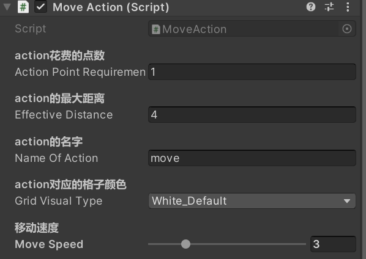

# turn-base-game-with-git Documentation
## 简介：
这是一个回合制游戏demo，皆在锻炼和展示技术，在未来会向其他类型发展。

# 索引
- [turn-base-game-with-git Documentation](#turn-base-game-with-git-documentation)
  - [简介：](#简介)
- [索引](#索引)
  - [全局可使用单例总集（此处链接到具体脚本，索引列表中链接到文档中的位置）](#全局可使用单例总集此处链接到具体脚本索引列表中链接到文档中的位置)
    - [TurnSystem.Instance:](#turnsysteminstance)
    - [UnitActionSystemUI.Instance](#unitactionsystemuiinstance)
    - [LevelGrid.Instance](#levelgridinstance)
    - [APathFind.Instance](#apathfindinstance)
    - [CameraController.Instance](#cameracontrollerinstance)
    - [UnitActionSystem.Instance](#unitactionsysteminstance)
  - [频繁使用的脚本总集（此处链接到具体脚本，索引列表中链接到文档中的位置）](#频繁使用的脚本总集此处链接到具体脚本索引列表中链接到文档中的位置)
    - [Unit.cs](#unitcs)
    - [BaseAction.cs](#baseactioncs)
    - [AttackAction.cs](#attackactioncs)
  - [如何创建一个新的自定义单位](#如何创建一个新的自定义单位)
  - [好用的Attribute：](#好用的attribute)
    - [Header:](#header)
    - [Space:](#space)
    - [Tooltip:](#tooltip)
    - [Range:](#range)
    - [TextArea:](#textarea)
    - [Multiline:](#multiline)
    - [SerializeField:](#serializefield)
    - [HideInInspector:](#hideininspector)
    - [ContextMenuItem:](#contextmenuitem)
    - [ContextMenu:](#contextmenu)
    - [HelpURL](#helpurl)
    - [RequireComponent](#requirecomponent)
    - [SelectionBase](#selectionbase)
    - [AddComponentMenu](#addcomponentmenu)
    - [ExecuteInEditMode](#executeineditmode)

## 全局可使用单例总集（此处链接到具体脚本，索引列表中链接到文档中的位置）
点击跳转到脚本
1. [TurnSystem.Instance](Assets/Script/UIRelated/TurnSystem.cs)
2. [UnitActionSystemUI.Instance](Assets/Script/UIRelated/UnitActionSystemUI.cs)
3. [LevelGrid.Instance](Assets/Script/GridRelated/LevelGrid.cs)
4. [APathFind.Instance](Assets/Script/GridRelated/APathFind.cs)
5. [CameraController.Instance](./Assets/Script/CameraAndMouse/CameraController.cs)
6. [UnitActionSystem.Instance](Assets/Script/Action/UnitActionSystem.cs)
   
[索引](#索引)

使用范例：`具体类型名称.Instance.具体方法名();
### TurnSystem.Instance:
```c#
public int GetTurnNumber(); //返回当前回合数（敌我行动一轮为一回合）
public void NextTurn();//进入下一回合（注意回合数会是两次调用该方法增加一次，可进行更改，以符合上一方法）
public bool IsPlayerTurn();//判断此时是不是玩家回合
```
[索引](#索引)
### UnitActionSystemUI.Instance
```c#
public void DestroyAllButton(); //删除屏幕下方的所有选项
```
[索引](#索引)
### LevelGrid.Instance
```c#
//生成一个常规的格子系统
public void CreateANewGridSystem(Transform transform);

//在单位切换位置时触发，可绑定
public event Action OnAnyUnitChangePosition;

//重新生成与当前格子系统匹配的寻路系统
public GridSystem<PathNode> CreateANewGridSystemPathNode();

//在gridPosition位置添加单位unit
public void AddUnitAtGridPosition(GridPosition gridPosition, Unit unit);

//在gridPosition位置移除单位unit
public void RemoveUnitAtGridPosition(GridPosition gridPosition, Unit unit);

//在to位置添加单位unit，在from位置移除单位unit
public void UnitMoveGridPosition(Unit unit, GridPosition from, GridPosition to);

//转换三维向量至格点坐标
public GridPosition GetGridPosition(Vector3 worldPosition);

//转换格点坐标至三维向量
public Vector3 GetWorldPosition(GridPosition gridPosition);

//判断gridPosition是否在系统允许范围内
public bool IsAValidGridPosition(GridPosition gridPosition);

//判断gridPosition位置上是否有单位
public bool HasAnyUnitOnGridPosition(GridPosition gridPosition);

//得到gridPosition位置上的Unit
public Unit GetUnitAtGridPosition(GridPosition gridPosition);

//返回格子系统宽度x
public int GetWidth();

//返回格子系统高度z
public int GetHeight();

//基于三维向量位置返回格点相对距离
public int GetGridDistance(Vector3 unit, Vector3 target);

//返回两个单位的格点相对距离
public int GetGridDistance(Unit unit, Unit target);

//返回格子大小
public int GetCellSize();
```
[索引](#索引)
### APathFind.Instance
```c#
//返回从startPosition到targetPosition的路径（按顺序存入列表中，正向遍历即为具体每步移动方向），需传入所有可通行的格点集UnBlockedGridPosition
public List<GridPosition> FindPath(GridPosition startPosition, GridPosition targetPosition, List<GridPosition> UnBlockedGridPosition);
```
[索引](#索引)
### CameraController.Instance
```c#
//将镜头中心对准worldPosition位置
public void FocusOnWorldPositon(Vector3 worldPosition);
```
[索引](#索引)
### UnitActionSystem.Instance
```c#
//选择友方单位时触发
public event Action SelectEvent;

//选择的action改变时触发
public event Action OnSelectedActionChange;

//采取任意action时触发
public event Action OnTakeAction;

//任意敌人被击杀时触发
public event Action OnEnemyDestroy;

//开始任意action和结束任意action时触发
public event Action OnBusyChange;

//发送内容为words的提示消息至屏幕中央下方
public void SendNotification(string words)；

//返回当前是否有单位在采取action
public bool GetBusyStatus()；

//返回当前选中的Unit
public Unit GetSelectedUnit();

//返回当前选中的action
public BaseAction GetSelectedAction();

//返回在场的所有unit组成的列表
public List<Unit> GetTotalUnitList();

//返回敌方unit列表
public List<Unit> GetEnemyUnitList();

//返回我方unit列表
public List<Unit> GetUnitList();

//将unit从列表中移除，根据isEnemy传入的值判断从哪个列表中移除
public void RemoveUnitFromList(Unit unit, bool isEnemy);

//将unit添加到列表中，根据isEnemy传入的值判断添加到哪个列表中
public void AddUnitToList(Unit unit, bool isEnemy);
```
[索引](#索引)
## 频繁使用的脚本总集（此处链接到具体脚本，索引列表中链接到文档中的位置）
点击跳转到脚本
1. [Unit.cs](Assets/Script/UnitRelated/Unit.cs)
2. [BaseAction.cs](Assets/Script/Action/BaseAction.cs)
3. [AttackAction.cs](Assets/Script/Action/AttackAction.cs)

[索引](#索引)
### Unit.cs
```c#

//归零异常状态列表
public void ClearStatus();


//添加或移除unitStatus状态
public void AddStatus(UnitStatsAndStatus.CurrentStatus unitStatus); 
public void RemoveStatus(UnitStatsAndStatus.CurrentStatus unitStatus); 

// 检查是否有unitStatus这一异常状态
public bool CheckStatus(UnitStatsAndStatus.CurrentStatus unitStatus);


//设置或获取stat属性，设置时需传入数量amount
//stat包括：
//UnitStatsAndStatus.Stats.attack, 攻击
//UnitStatsAndStatus.Stats.defense, 防御
//UnitStatsAndStatus.Stats.armor, 护甲
//UnitStatsAndStatus.Stats.health. 生命
public void SetStats(int amount, UnitStatsAndStatus.Stats stat);
public int GetStats(UnitStatsAndStatus.Stats stat);

  


//返回描述的数值
public GridPosition GetGridPosition();
public Vector3 GetWorldPosition();
public int GetCurrentActionPoint();
public bool GetUnitType();
public int GetUnitAttackTotal();
public int GetUnitAttackBase();
public int GetUnitCurrentHealth();
public int GetUnitMaxHealth();

//返回unit是否死亡
public bool IsDead();

//剩余方法可查看脚本，在其他地方基本用不到故不全部列出
```
[索引](#索引)
### BaseAction.cs
```c#
//BaseAction为基类，需要继承后使用


//如果继承则必须覆写该方法，返回能采取action的有效格点位置列表
public abstract List<GridPosition> GetValidGridPositionList();

//判断resultGridpos是否在action有效范围内，默认范围趋近一个圆形，可覆写
public virtual bool InvalidDistance(GridPosition resultGridPos);

//返回单位是否受异常状态影响而不能采取该action，默认恒返回true，可覆写以添加判断，若覆写则需一并覆写下一方法
public virtual bool HandleUnitState();
//该方法与上一方法需一起覆盖写，返回异常状态发生时，屏幕中下处应该返回的信息
public virtual string GenerateUnitStateErrorMessage();

//返回action挂在哪个unit上
public Unit GetUnit();

//必须覆写以完成ai逻辑，返回当前格点位置采取该行为的价值
protected abstract int CalculateEnemyAIActionValue();
```
[索引](#索引)
### AttackAction.cs
```c#
//默认使用类圆形判断目标是否在攻击范围内，并返回所有范围内目标的位置，可覆写
public virtual List<GridPosition> GetGridPositionListInRange();

//对targetUnit造成伤害
public bool CauseDamage()；

//对actuaHitUnit造成伤害，一般为可能造成误伤的射击攻击中使用
public bool CauseDamage(Unit actualHitUnit);


// 默认恒返回true，覆写可决定什么时候使用攻击特写镜头
protected virtual bool ShouldUseAttackCamera();

// 使用攻击镜头，默认为右肩膀靠后处朝向目标单位的角度，可覆写，具体规则见下面：
protected virtual void UseAttackCamera();

//UseAttackCamera中必须要invoke这个event，这个event的args具体见下面
public static event EventHandler<AttackActionCameraArgs> OnAttackActionCameraRequired;

//cameraPosition为特写镜头应该放在哪里， cameraLookAtPosition为看向哪里
public class AttackActionCameraArgs : EventArgs {

    public Vector3 cameraPosition;
    public Vector3 cameraLookAtPosition;

    //这是一个构造函数
    public AttackActionCameraArgs(Vector3 cameraPosition, Vector3 cameraLookAtPosition) {
        this.cameraPosition = cameraPosition;
        this.cameraLookAtPosition = cameraLookAtPosition;
    }
}
//使用例子：
Vector3 height =new Vector3(0, attackCameraPosition.position.y, 0);
OnAttackActionCameraRequired?.Invoke(this, new AttackActionCameraArgs(attackCameraPosition.position, targetUnit.GetWorldPosition() + height));


//覆写这个协程以完成具体的攻击动作，攻击逻辑的编写
protected virtual IEnumerator SpecificAttack();
```
SpecificAttack() 范例见[shootAction.cs](Assets/Script/Action/ShootAction/ShootAction.cs)

[索引](#索引)


## 如何创建一个新的自定义单位
1. 首先先找到这个unit prefab并复制一份作为独立prefab


- 高亮选项处可删除并替换自己的模型

- 高亮处为animator位置，可在此替换animator controller

  
2. 检查Inspector, 确保以下脚本中，除了ShootAction, SpinAction外都已经正确添加，单位碰撞体可以自行添加和调整，以符合角色模型的大致形状，注意，Layer一定要选择UnitSelection.
   


3. 对于每一个基础的Action,在面板中编辑花费点数，最大距离，名字和对应格子颜色，剩下的部分也请[SerializeField]到面板中编辑，如此处MoveAction的移动速度，[SerializeField] 为unity中很好用的Attribute, [其他好用的Attribute可点击这里查看](#好用的attribute)



4. 此处配置单位的基础属性， 
   - Attack为命中率，Defense为防御，Base Attack为基础命中率，命中率计算公式 = Attack + Base Attack - Defense
   - Armor为护甲，Armor/200为减免非破甲伤害的数值，Armor最高为200、
   - Max Health为最大生命值，Current Health 为当前生命值
   - Current/Max Action Point 当前/最大 行动点数
   - Is Enemy, 此处打勾时单位会被认为是敌方单位无法选中，如果想让敌方单位具有AI,请同时添加[Enemy AI](Assets\Script\UnitRelated\EnemyAI\EnemyAI.cs)脚本，并完成该单位身上所有Action中的CalculateEnemyAIActionValue()方法，EnemyAI会自动采取分数最高的Action，所以可以在计算分数时融入多个考虑因素。
   


5. 此处为继承AttackAction后相关的配置，所有的攻击行为请继承AttackAction
   - 基础设置同常规的action,如上面的Move Action
   - 武器威力部分，分为常规伤害（Base Weapon Damage）和穿甲伤害（AP weapon Damage） 
     - 计算公式为，攻击判定命中后->常规伤害  * （（1- 护甲减免值）+ 穿甲伤害） * random（1 - 浮动率， 1 + 浮动率）
   - 攻击镜头特写位置请在模型中创建一个空子物体来设置位置，在脚本中可直接套用
   - 子弹部分为shoot Action具体实现逻辑的一部分，这一部分根据自己的攻击具体实现逻辑进行调整


[索引](#索引)


## 好用的Attribute：
### Header: 
adding a header above fields in the Inspector. 

    [Header ("Sphere variable")]
    public GameObject ball;
 
    [Header ("======Capsule variable======")]
    public GameObject capsule;
    public Vector3 capsulePosition;
[索引](#索引)
### Space: 
creating a space between fields.

    [Space (50)]
    [Header ("======Capsule variable======")]
    [Space (50)]

[索引](#索引)
### Tooltip: 
creates a tooltip, that appears once you hover over the variable with the attribute.

    [Tooltip (“text”)]
    public Vector3 capsulePosition;
[索引](#索引)
### Range: 
This attribute is used to give you a slider, to select values within a range, directly from the Unity Editor

    [Range (float value ,float value)]
    public float capsuleScale;
[索引](#索引)
### TextArea:
The TextArea attribute is useful when you have to add a long string (long text, message) in a string variable via the editor.

    [TextArea]
    public string aboutCapsule;
[索引](#索引)

### Multiline: 
Works the same way, as the TextArea to store long text values. The only difference is the horizontal and vertical wrapping of text. TextArea types text like a paragraph so when the line ends it will automatically move to the next line. But Multiline continuously displays data in the same line.

    [Multiline]
    public string location;
[索引](#索引)

### SerializeField: 
show in inspector

    [SerializeField]
    private int objectNumber;
[索引](#索引)
### HideInInspector: 
used to hide public variables in the inspector.

    [HideInInspector]
    public bool isEnd;
[索引](#索引)
### ContextMenuItem: 
When you assign the ContextMenuItem attribute to any variable. It will display a menu option when right-clicking the variable in the Inspector.

    [ContextMenuItem("Get a random scale", "RandomScale")]
    private float randomScale;
[索引](#索引)
### ContextMenu: 
The ContextMenu attribute will create a menu item when right-clicking the component instead of a specific variable. After selecting the menu option, the corresponding function will perform its task.

    [ContextMenu("isEnd is true")]
    void ChangeBool()   
    {
	    isEnd=true;
    }
[索引](#索引)
### HelpURL
The HelpURL attribute will use to links, that send the user to e.g. the documentation. This attribute must be added above the class definition.

    [HelpURL("https://www.youtube.com/channel/UCGjv_3tbzJ8yKuvacoqmO-Q&gt;")]
    public class AttributesDemoScript : MonoBehaviour
    {
    }

[索引](#索引)  
### RequireComponent
The RequireComponent attribute will assign a component automatically to the current game object. This attribute is useful when we know that that a script is going to be using specific components of the game object. Not only that, but it also prevents anyone from removing the component from the object.

    [RequireComponent(typeof (RigidBody))]
[索引](#索引)
### SelectionBase
prevents the frustration of selecting a child object when you meant to select the parent object.
    
    [SelectionBase]
    public class AttributesDemoScript : MonoBehaviour
    {
    }
[索引](#索引)
### AddComponentMenu
Using this attribute you will add a customize Component in Unity.
You can find this a new component in the “Component Menu” on or “Add Component” in the Inspector Window.

    [AddComponentMenu("My Menu/New Component")]
    public class AttributesDemoScript : MonoBehaviour   
    {
    }
[索引](#索引)
### ExecuteInEditMode
When ExecuteInEditMode attribute applied to a class the script it will perform whatever tasks it would normally do in play mode from the edit mode.

    [ExecuteInEditMode]
    public class AttributesDemoScript : MonoBehaviour
    {
        void Start()
        {
    	    GetComponent<Transform>().localScale = new Vector3(2, 2, 2);
        }
    }
[索引](#索引)

有待完善